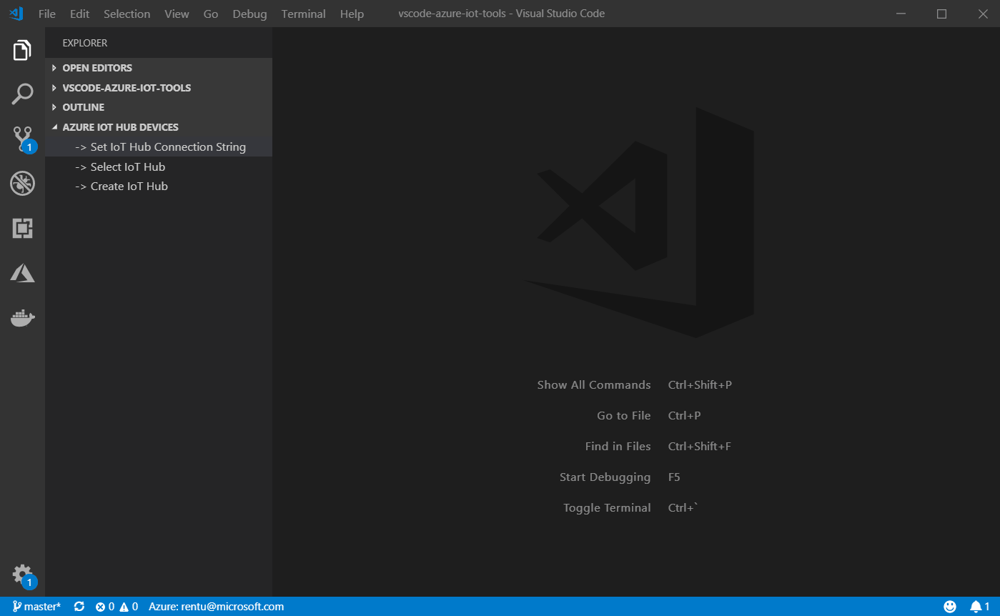
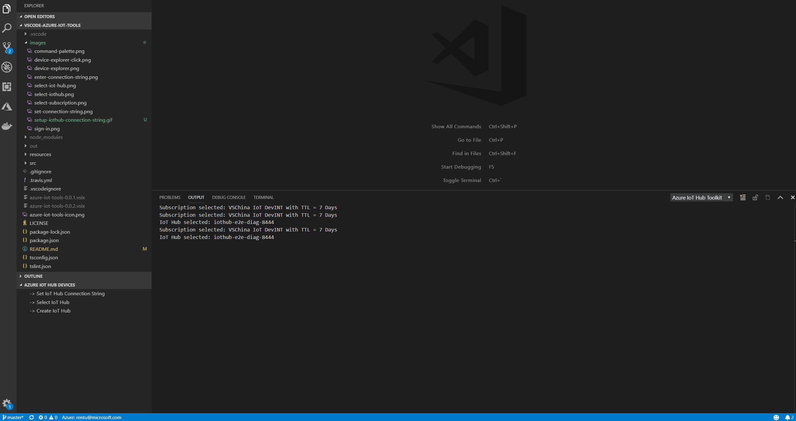
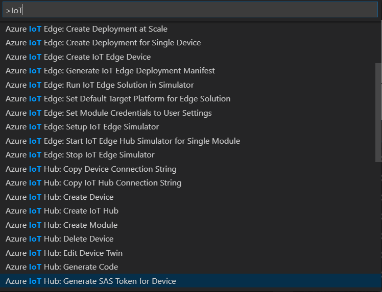

# Azure IoT Tools for Visual Studio Code
[Microsoft Azure IoT](https://azure.microsoft.com/en-us/overview/iot/
) support for Visual Studio Code is provided through a rich set of extensions that make it easy to discover and interact with Azure IoT Hub that power your IoT Edge and device applications.

> If you do not have an Azure subscription, [sign up today](https://azure.microsoft.com/en-us/free/?b=16.48) for a free account. You'll get 12 months of popular free services, **$200** in Azure Credits to try out any combination of Azure services, and access to free services such as Azure IoT Hub, Azure IoT Edge, etc.

## Azure IoT Services
- Develop and connect your [Azure loT Applications](https://azure.microsoft.com/en-us/overview/iot/) to Azure using the [Azure loT Toolkit](https://marketplace.visualstudio.com/items?itemName=vsciot-vscode.azure-iot-toolkit). With this extension, you can interact with an Azure loT Hub, manage connected devices, and enable distributed tracing for your Azure loT applications.

- Develop and debug [Certifies Azure loT Devices](https://catalog.azureiotsolutions.com/alldevices) (including [MXChip loT DevKit](http://www.mxchip.com/az3166), [ESP32](https://catalog.azureiotsolutions.com/details?title=ESP32_DevKitC&source=all-devices-page), [Raspberry Pi](https://www.adafruit.com/category/288)) to Azure using the [Azure loT Device Workbench](https://marketplace.visualstudio.com/items?itemName=vsciot-vscode.vscode-iot-workbench). The loT Device Workbench extension makes it easy to code, build, deploy and debug your loT applications with popular loT development boards.

- Develop and deploy artificial intelligence and your custom logic to [Azure loT Edge](https://azure.microsoft.com/en-us/services/iot-edge/) with [Azure loT Edge for VS Code](https://marketplace.visualstudio.com/items?itemName=vsciot-vscode.azure-iot-edge). Azure loT Edge extension makes it easy to code, build, deploy, and debug your loT Edge applications.

## Installation
By installing this extension you will install all of the extensions listed above. Some of these extensions will have a dependency on the [Azure Account extension](https://marketplace.visualstudio.com/items?itemName=ms-vscode.azure-account) to provide a single Azure login and subscription filtering experience.

You can easily uninstall individual extensions if you are not interested in using them, without affecting other extensions provided by this pack. You can uninstall all of the extensions by uninstalling the Azure Tools extension.

## Setup Azure IoT Hub for Extension
After successfully installing this extension, you can follow the steps below to setup your IoT Hub. you can use **IoT Hub connection string** or **sign in to Azure** to select IoT Hub:

#### Setup Azure IoT Hub through Connection String
You can use IoT Hub connection string to setup your IoT Hub

1. In Explorer of VS Code, click "Azure IoT Hub Devices" in the bottom left corner.

2. Click "Set IoT Hub Connection String" in context menu.

3. An input box will pop up, then enter your IoT Hub Connection String (It is one-time configuration, and please make sure it is **IoT Hub Connection String** and not **Device Connection String**. The format is `HostName=<my-hub>.azure-devices.net;SharedAccessKeyName=<my-policy>;SharedAccessKey=<my-policy-key>`).

4. The device list will be shown.

5. Then you can manage your devices and interact with Azure IoT Hub through context menu.

> **NOTE**: You can also go to **File** > **Preferences** > **Settings** (**Code** > **Preferences** > **Settings**), and update the configuration of `azure-iot-toolkit.iotHubConnectionString` to change your IoT Hub Connection String.

#### Setup Azure IoT Hub through Sign in to Azure

Instead of copying and pasting to set IoT Hub Connection String, you can sign in to Azure and select IoT Hub from your Azure Subscription.
1. In Explorer of VS Code, click "Azure IoT Hub Devices" in the bottom left corner.

2. Click "Select IoT Hub" in context menu.

3. If you have not signed in to Azure, a pop-up will show to let you sign in to Azure.

4. After signing in, your Azure Subscription list will be shown, then select an Azure Subscription.

5. Your IoT Hub list will be shown, then select an IoT Hub.

6. The device list will be shown.

## Command Palette
You can access almost all Azure IoT Services provided by these extensions through the Command Palette. Simply press F1, then type in **IoT** to find available commands.

## Contributing 

Got a suggestion for the Azure IoT Tools extension? Submit a new issue and a PR with an updated `package.json` and `README.md` and we'll take a look! 

Most contributions require you to agree to a Contributor License Agreement (CLA) declaring that you have the right to, and actually do, grant us the rights to use your contribution. For details, visit https://cla.microsoft.com.

When you submit a pull request, a CLA-bot will automatically determine whether you need to provide a CLA and decorate the PR appropriately (e.g., label, comment). Simply follow the instructions provided by the bot. You will only need to do this once across all repos using our CLA.

This project has adopted the [Microsoft Open Source Code of Conduct](https://opensource.microsoft.com/codeofconduct/). For more information see the [Code of Conduct FAQ](https://opensource.microsoft.com/codeofconduct/faq/) or contact [opencode@microsoft.com](mailto:opencode@microsoft.com) with any additional questions or comments.

## License

[MIT](LICENSE)